# Case Study: Sample Client Deliverables Pack

## Summary

This case study documents what a small VPS/Docker support engagement should leave behind after the technical work is done: screenshot evidence, a concise incident report, and a handover note that another operator can use.

It is a public demonstration pack, not a claim about a private client system. The goal is to make the output of a scoped rescue or monitoring job easy to inspect before any real customer material is published.

## Problem

Small teams often receive fixes without usable operational evidence:

- no before/after screenshots,
- no root-cause summary,
- no clear command trail,
- no handover note,
- no documented next steps.

That makes support work hard to trust and harder to maintain after the engineer leaves.

## Deliverables In This Pack

- Sample incident report: `examples/sample-incident-report.md`
- Sample handover note: `examples/sample-handover-note.md`
- Screenshot checklist: `docs/01-screenshots-checklist.md`
- Public screenshot manifest: `screenshots/public/README.md`
- Public screenshot captions: `screenshots/public/captions.md`

## Intended Workflow

1. Diagnose the issue with the toolkit scripts.
2. Capture redacted screenshots of the important moments.
3. Write the incident report with root cause, fix, verification, and remaining risks.
4. Write the handover note with what to check first next time.
5. Publish only the redacted evidence that is safe to share.

## Evidence Structure

The public screenshot set is intentionally predictable:

| File | Purpose |
|---|---|
| `01-diagnostics-run.png` | show the command and high-level system context |
| `02-report-folder.png` | show generated diagnostics output exists |
| `03-container-before.png` | show failing or suspicious container state |
| `04-healthcheck-failed.png` | show the public symptom or simulated failure |
| `05-fix-applied.png` | show the scoped change or command summary |
| `06-healthcheck-passed.png` | show recovery |
| `07-backup-created.png` | show backup artifact created |
| `08-checksum-verified.png` | show checksum or integrity verification |
| `09-restore-test.png` | show restore proof into safe target |
| `10-monitoring-dashboard.png` | show monitoring visibility |
| `11-incident-report.png` | show final report or handover note |

## Public Screenshot Set

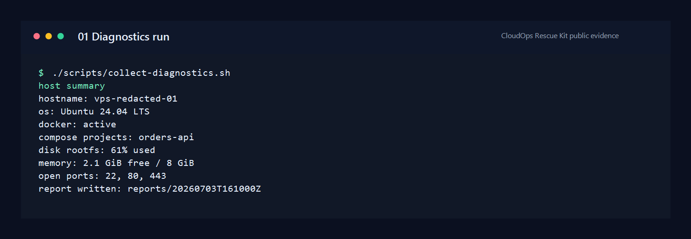

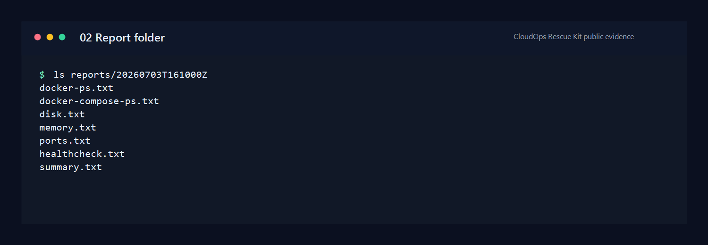

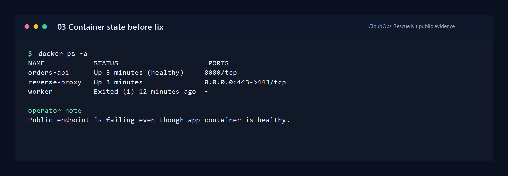

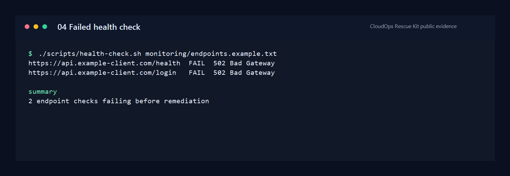

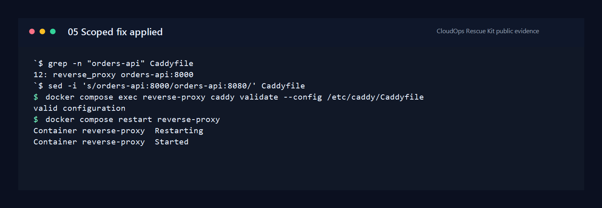

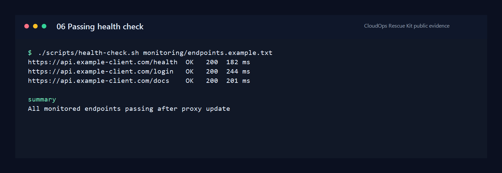

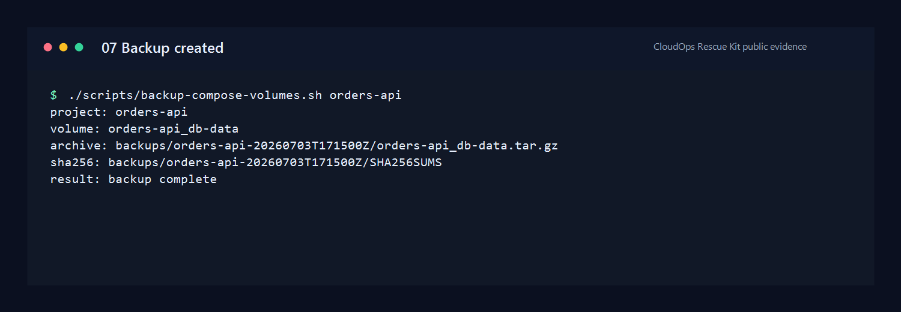

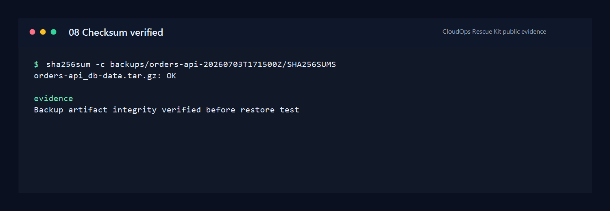

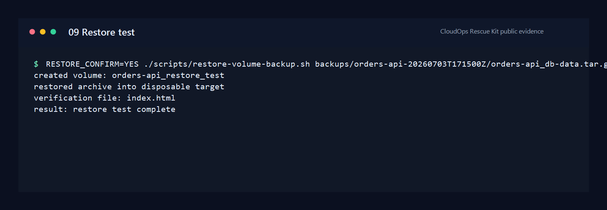

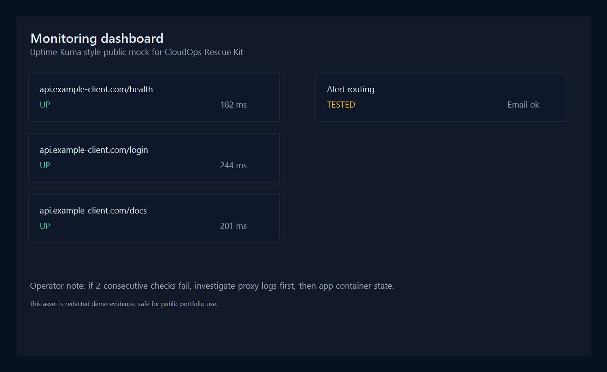

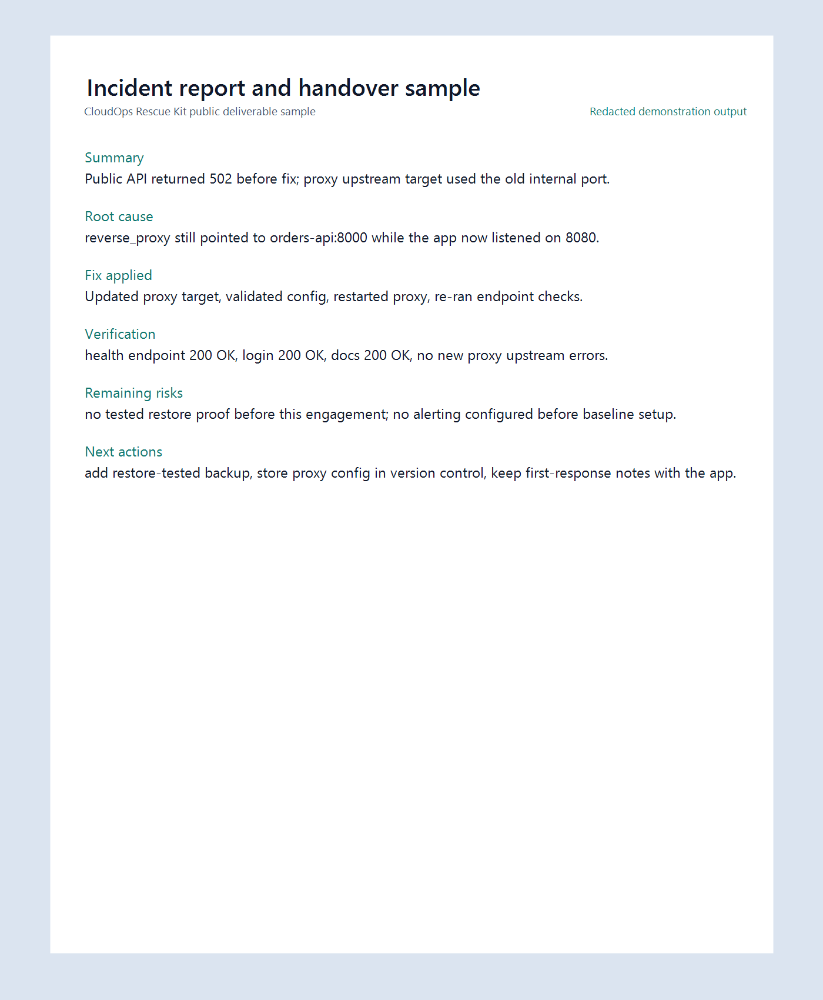

## What Good Output Looks Like

A strong public support case study should let a reviewer answer these questions quickly:

- what was broken,
- what checks were run,
- what changed,
- how the result was verified,
- what remains risky,
- what the next operator should do.

## What This Pack Proves

This pack proves the repo now includes more than scripts and templates:

- a realistic sample incident report,
- a realistic sample handover note,
- a screenshot manifest for publishable evidence,
- caption guidance for a future public screenshot set.

## What Still Needs Real Capture

This pack does not replace live screenshots from a VPS or Linux VM run.

Still needed for the strongest public proof:

- actual redacted screenshots under `screenshots/public/`,
- one screenshot-backed public rescue case study,
- one screenshot-backed monitoring/handover case study.

## Next Step

Run the demo lab or a safe VPS exercise, capture the screenshot files listed in `screenshots/public/README.md`, and update this case study with links to the actual image files.
